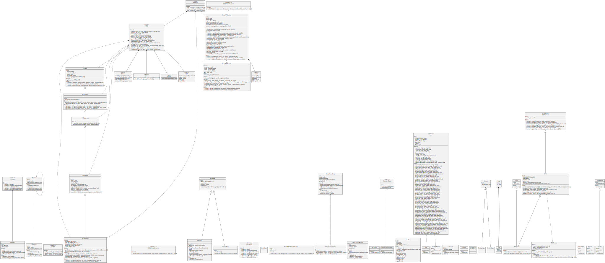

# EDI-NFT Protocol

> NFT Protocol

## Overview

Creation of NFT-based primitives via EDI Mappings

## Valid Server Setup

1. Deploy the NFT and Master Proxy contracts

2. Deploy the Universal Proxy contract with the Master Proxy's address and an
   admin address (this should be a human account) as input

3. Deploy the Controller contract with the Universal Proxy's address and an admin
   address (the same address as in step 2) an input

4. Call `changeController` through the Universal Proxy from the admin address.
   The controller should be changed to the controller address deployed in step

Steps 1-3 cannot be performed through the API. Step 4 can if the `controller_address`
is originally set to equal the `universal_address`. This solution is not ideal,
so all of steps 1-4 should be completed during server setup.

## Security & Development

The basic smart contract implementation is a functional set of smart contracts which will meet the implementation needs of any company using EDI X12/EDIFACT\*.

> These smart contracts will need to be updated for gas efficiency and to verify their security in the upcoming weeks.

The continuous integration for github is a script which will run the postman and truffle tests on new commits added to the github repository.

The truffle tests are a set of javascript unit tests which will verify the modular properties of the code base to ensure that it always meets the intention of the smart contract architecture. They are designed to have near complete code coverage and thus should prevent most bugs.

The postman api unit tests are a set of tests for each api endpoint that verify that the endpoints will reject on invalid inputs and return the right data types.

In combination with the truffle tests, the postman tests will verify the integrity of the whole codebase.

The javascript endpoint implementation of the endpoints extend the test endpoints from last week. Now, in addition to data sanitation and returning proper values, they will parse the input data, format transactions and make ethereum calls through the infura web3. The new endpoints will also properly validate Corporate signatures of the nonce which protects admin transactions.

## Usage

SEE [API](/postman)

## Deployments

SEE [DEPLOYMENTS](/deployments)

## License

Copyright 2020 (C) FreightTrust and Clearing Corporation All Rights Reserved - https://freighttrust.com

This Source Code Form is subject to the terms of the Mozilla Public License, v. 2.0. If a copy of the MPL was not distributed with this file, You can obtain one at https://mozilla.org/MPL/2.0/
